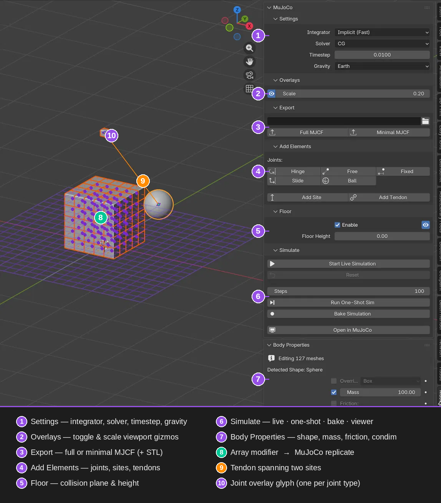
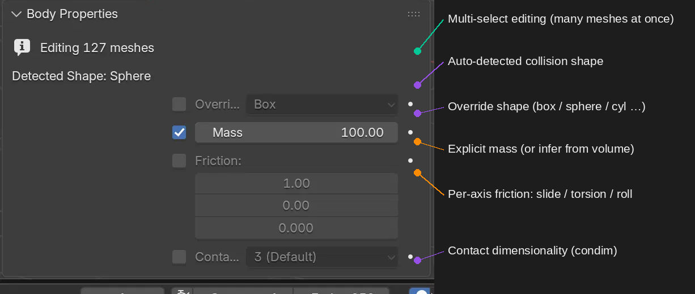

# Blujoco

**MuJoCo physics, natively inside Blender.**

Blujoco is a Blender 4.2+ add-on that turns Blender into a front-end for the
[MuJoCo](https://mujoco.org/) physics engine. Define rigid bodies, joints,
tendons and sites with familiar Blender objects, tune the solver, run the
simulation live in the viewport, bake it to keyframes, or export an MJCF model
without leaving Blender.

## Feature Overview

<p align="center">
  <video src="Features.mp4" controls width="900">
    Your browser does not support embedded video. You can download the feature
    overview video from <a href="Features.mp4">Features.mp4</a>.
  </video>
</p>

<p align="center">
  
</p>

## Highlights

- **Full MuJoCo authoring**: choose the integrator, constraint solver, timestep
  and gravity, then add joints, sites and tendons from one sidebar.
- **Live viewport simulation**: step MuJoCo at 60 FPS and watch Blender objects
  move in real time.
- **Selection-based iteration**: build the simulation model from selected meshes,
  so you can test one mechanism without changing the rest of the scene.
- **Per-mesh physics controls**: override collision shape, set mass, tune
  per-axis friction and contact dimensionality, with edits synced across
  multi-selection.
- **Tendons and sites**: connect bodies with spatial tendons, stiffness, damping,
  length limits and optional renderable tube geometry.
- **Array modifier support**: convert Blender Array modifiers, including Geometry
  Nodes arrays, into MuJoCo replicate blocks.
- **Readable overlays**: draw distinct viewport glyphs for joints, sites,
  tendons and the simulation floor.
- **MJCF export**: export full MJCF with STL mesh assets, minimal geom-only MJCF,
  or inspect the scene in MuJoCo's native viewer.

## Interface Tour

| # | Area | What it does |
|---|------|--------------|
| 1 | **Settings** | Integrator, solver, timestep and gravity presets. |
| 2 | **Overlays** | Toggle and scale MuJoCo viewport gizmos. |
| 3 | **Export** | Write full or minimal MJCF files. |
| 4 | **Add Elements** | Add hinge, slide, free, ball and fixed joints, plus sites and tendons. |
| 5 | **Floor** | Enable a collision floor plane, set floor height and toggle the grid overlay. |
| 6 | **Simulate** | Start live simulation, run a fixed-step simulation, bake to keyframes or open the MuJoCo viewer. |
| 7 | **Body Properties** | Edit per-mesh shape, mass, friction and contact settings. |
| 8 | **Array Modifier** | Use one editable mesh to represent replicated MuJoCo bodies. |
| 9 | **Tendon** | Span a spatial tendon between two sites across bodies. |
| 10 | **Joint Glyph** | See a distinct overlay symbol for each joint type. |

## Body Properties

Select one or many meshes and edit their physics in place. Blujoco can infer a
collision shape from the mesh, while still letting you override shape, mass,
friction and contact settings when you need direct control.

<p align="center">
  
</p>

## Requirements

- Blender 4.2 or newer
- The MuJoCo Python package installed in Blender's bundled Python

```bash
/path/to/blender/python/bin/python3.x -m pip install mujoco
```

Blujoco loads gracefully without MuJoCo installed, but simulation and export
operators require the Python package.

## Installation

The plugin source is currently private. For access, releases, or installation
instructions, contact the project maintainer.

Once installed:

1. Enable **Blujoco** in Blender Preferences.
2. Open the **MuJoCo** tab in the 3D Viewport sidebar with `N`.
3. Select the meshes you want to simulate.
4. Add joints, sites or tendons from the sidebar.
5. Run live simulation, bake the result, or export MJCF.

## License

Blujoco is licensed as GPL-2.0-or-later.
